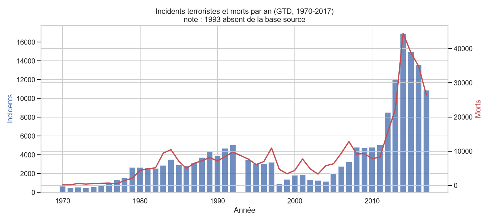
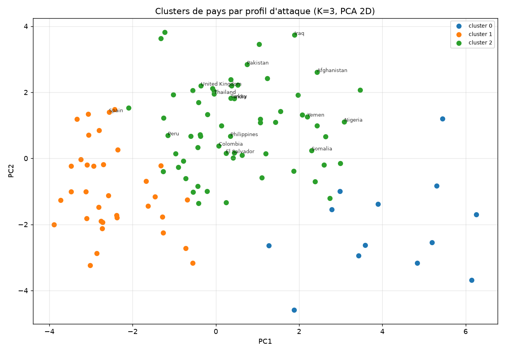

# Analyse spatio-temporelle du terrorisme mondial (GTD)

> ⚠️ **Projet à visée académique et analytique.** Il décrit des dynamiques
> historiques (1970-2017) à partir de données ouvertes. Il **ne prédit pas
> d'attaques**, ne cible aucune population et ne fonde aucune décision
> opérationnelle. Voir la section **Limites & éthique**, qui fait partie
> intégrante du livrable.

Comprendre **où**, **quand** et **comment** le terrorisme s'est manifesté ;
construire un **indice de pression** par pays ; identifier des **familles de
pays** aux profils d'attaque similaires ; et mesurer ce qu'un modèle peut
honnêtement prédire à partir des seules caractéristiques d'un incident.

---

## 1. Problème & angle décisionnel

À visée de recherche sécuritaire/académique : caractériser les dynamiques
spatio-temporelles du terrorisme, synthétiser une « pression » par pays/région
pondérée par la sévérité, et **discuter explicitement** ce que ces analyses
peuvent — et surtout ne peuvent pas — dire.

## 2. Données

- **Source :** [Global Terrorism Database (GTD)](https://www.kaggle.com/datasets/START-UMD/gtd/data),
  START / University of Maryland.
- **Volume :** **181 691 incidents**, 1970-2017, ~135 variables (date, pays,
  ville, coordonnées, type d'attaque, cible, arme, victimes, groupe…).
- **Accès :** la GTD **n'est pas redistribuable** et n'a **pas d'API**. Le
  loader (`src/data.py`) lit le CSV officiel Kaggle depuis `data/raw/`,
  `~/Downloads/` ou la variable d'environnement `GTD_CSV`, met en cache un
  parquet allégé, et — à défaut de fichier — génère un **substitut synthétique**
  documenté (même schéma) pour que le pipeline reste exécutable.
- **Encodage :** latin-1 (géré automatiquement).

## 3. Méthodologie

| Étape | Module | Contenu |
|---|---|---|
| Chargement | `src/data.py` | Détection du CSV officiel, cache parquet, fallback synthétique |
| Nettoyage | `src/preprocessing.py` | Casualties manquantes → 0 + flag, sentinelles `nperps`, dates (mois/jour 0), trou **1993**, sévérité & cible `lethal` |
| EDA | `src/eda.py` | Tendance annuelle, heatmap région×décennie, typologie attaque/cible, carte densité |
| Pression | `src/pressure_index.py` | Indice composite fréquence/létalité/intensité/récence + choroplèthe |
| Clustering | `src/clustering.py` | **K-Means** sur profils d'attaque par pays (K par silhouette) + PCA 2D |
| Modèles | `src/models.py` | Classification (létal ?) + régression (sévérité), **split temporel** ≤2013/≥2014 |

Trois familles de techniques (au-delà des deux requises) : **agrégation
spatio-temporelle**, **clustering non supervisé**, **modélisation supervisée**
(classification + régression).

## 4. Résultats clés

### Dynamique temporelle
Activité modérée jusqu'aux années 2000 puis explosion à partir de ~2004,
**pic en 2014 (~16 900 incidents)**. Bilan : **411 868 morts** sur la période ;
45,8 % des incidents sont létaux. *(1993 est absent de la base source.)*

### Indice de pression — top pays

| Pays | Incidents | Morts | Sévérité moy. | Indice |
|---|---|---|---|---|
| Irak | 24 636 | 78 589 | 5,9 | **0,84** |
| Afghanistan | 12 731 | 39 384 | 4,8 | 0,80 |
| Pakistan | 14 368 | 23 822 | 3,1 | 0,77 |
| Nigéria | 3 907 | 22 682 | 7,1 | 0,74 |

### Clustering (3 familles, K par silhouette sur 111 pays)
- **Forte létalité/incident** — Sahel, RDC, Mali (assauts armés meurtriers).
- **Profil occidental** — Espagne, USA, France (faible létalité, cibles
  infrastructures/entreprises).
- **Volume & bombardements** — Irak, Pakistan, Afghanistan, Inde.

### Modèles prédictifs (split temporel ≥2014)

| Tâche | Modèle | Score |
|---|---|---|
| Létalité (classif.) | Gradient Boosting | accuracy 0,71 · ROC-AUC 0,78 · F1 0,72 |
| Sévérité (régression) | Gradient Boosting | R² 0,24 · MAE ≈ 3,4 victimes |

La léthalité est modérément prédictible (type d'attaque + région) ; la
**sévérité exacte** ne l'est pas à partir de ces variables — résultat honnête
qui borne le pouvoir explicatif des données.

| | |
|---|---|
|  |  |

## 5. Limites & éthique *(section obligatoire)*

**Biais de données**
- **Biais de reporting** : sources et couverture inégales selon époques/régions ;
  la hausse post-2004 mêle recrudescence réelle et meilleure documentation.
- **Incomplétude** : casualties manquantes (~9 %), groupe inconnu (~46 %),
  **année 1993 entièrement perdue**.
- **Définition mouvante** : l'inclusion repose sur les critères de START, qui
  comportent une part de jugement et évoluent.

**Éthique**
- Usage **descriptif et académique**. Ces modèles **ne doivent pas** prédire des
  attaques individuelles, profiler des communautés, ni justifier des mesures
  ciblées : les corrélations historiques ne sont ni causales ni prescriptives.
- Un indice de « pression » par pays est **potentiellement stigmatisant** hors
  contexte : il mesure une exposition historique, pas une culpabilité ni un
  risque futur.
- Réutilisation **dual-use** à manier avec précaution, dans le respect de la
  licence GTD.

## 6. Reproduction

```bash
conda create -n gtd python=3.11 -y && conda activate gtd
pip install -r requirements.txt

# Placez globalterrorismdb_0718dist.csv dans data/raw/ (ou ~/Downloads/),
# ou exportez GTD_CSV=/chemin/vers/le.csv
python src/data.py            # cache parquet allégé
python src/preprocessing.py   # nettoyage + features
python src/eda.py             # figures + carte densité
python src/pressure_index.py  # indice de pression + choroplèthe
python src/clustering.py      # familles de pays
python src/models.py          # classification + régression
python notebooks/build_notebook.py
```

## 7. Structure du repo

```
04-global-terrorism-gtd/
├── data/                 # CSV officiel + caches parquet (NON versionnés)
├── notebooks/
│   ├── 04_global_terrorism.ipynb
│   └── build_notebook.py
├── src/
│   ├── data.py           preprocessing.py   eda.py
│   ├── pressure_index.py clustering.py      models.py
├── reports/
│   ├── figures/          # PNG + 3 cartes HTML interactives
│   └── *.csv             # métriques, indices, clusters
├── README.md
└── requirements.txt
```
